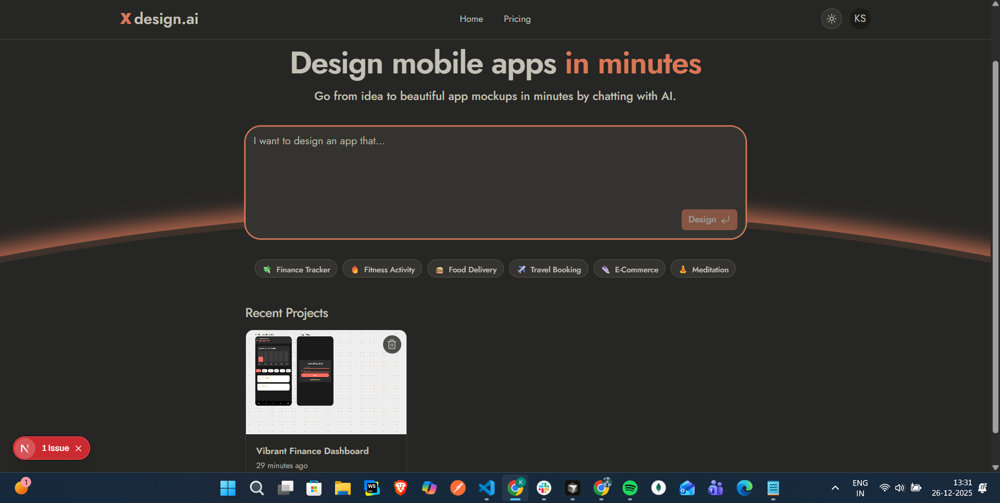

# 🎨 XDesign.ai - AI-Powered Mobile App Design Tool

<div align="center">

**Transform your ideas into stunning mobile app mockups in minutes using AI**

[](https://nextjs.org/)
[](https://react.dev/)
[](https://www.typescriptlang.org/)
[](https://www.prisma.io/)
[](https://tailwindcss.com/)

[Live Demo](#) • [Documentation](#) • [Report Bug](#) • [Request Feature](#)

</div>

---

<div align="center">



*XDesign.ai - AI-Powered Mobile App Design Interface*

</div>

---

## 📖 Overview

**XDesign.ai** is an innovative AI-powered platform that enables designers, developers, and entrepreneurs to create beautiful, production-ready mobile app mockups through natural language conversations. Simply describe your app idea, and watch as AI generates stunning, Dribbble-quality UI screens with modern design patterns, glassmorphism effects, and interactive components.

### ✨ Key Features

- 🤖 **AI-Powered Design Generation** - Create complete mobile app designs by describing your vision in plain English
- 🎨 **Dribbble-Quality UI** - Generate premium, modern interfaces with glassmorphism, gradients, and micro-interactions
- 📱 **Multiple Screen Support** - Generate 1-4 interconnected screens with consistent design systems
- 🎭 **Theme Customization** - Choose from multiple pre-built themes (Midnight, Ocean Breeze, Neo-Brutalism, and more)
- 🖼️ **Real-time Preview** - See your designs come to life with live HTML rendering in device frames
- 📊 **Smart Components** - AI generates charts, navigation bars, cards, and interactive elements automatically
- 💾 **Project Management** - Save, organize, and revisit your design projects
- 🔄 **Incremental Updates** - Add or modify screens while maintaining design consistency
- 📸 **Screenshot Generation** - Export your designs as high-quality screenshots
- 🌙 **Dark Mode** - Beautiful dark theme with customizable color schemes

---

## 🚀 Tech Stack

### Frontend
- **Next.js 16.1.1** - React framework with App Router
- **React 19.2.3** - UI library
- **TypeScript** - Type-safe development
- **Tailwind CSS 4.0** - Utility-first CSS framework
- **Radix UI** - Accessible component primitives
- **Lucide React** - Icon library
- **React Query** - Data fetching and caching

### Backend & AI
- **OpenAI API** (via OpenRouter) - AI model integration
- **Inngest** - Background job processing and real-time updates
- **Prisma** - Type-safe database ORM
- **MongoDB** - NoSQL database
- **Resend** - Email service integration

### Tools & Libraries
- **Puppeteer** - Screenshot generation
- **Zod** - Schema validation
- **Kinde Auth** - Authentication
- **Shiki** - Syntax highlighting
- **Date-fns** - Date utilities

---

## 🎯 How It Works

1. **Describe Your App** - Enter your app idea in the prompt box (e.g., "I want to design a fitness tracking app")
2. **AI Analysis** - Our AI analyzes your request and plans the necessary screens
3. **Design Generation** - AI generates beautiful HTML/CSS designs using Tailwind and modern UI patterns
4. **Real-time Preview** - Watch your designs render in real-time within device frames
5. **Customize & Export** - Modify themes, add screens, and export your designs

---

## 📸 Screenshots

### Landing Page


The main interface features a clean, modern design with:
- **Prominent Input Field** - Enter your app idea in the large, rounded input box with orange accent border
- **Quick-Start Categories** - Six pre-built category suggestions:
  - 💰 Finance Tracker
  - 🔥 Fitness Activity
  - 🍔 Food Delivery
  - ✈️ Travel Booking
  - 🛍️ E-Commerce
  - 🧘 Meditation
- **Recent Projects** - View your latest design projects with thumbnails and timestamps
- **Dark Theme** - Beautiful dark interface with orange accent colors
- **User Profile** - Easy access to your account and settings

### Design Canvas
- Interactive device frame preview
- Zoom and pan controls
- Theme selector
- Real-time HTML rendering
- Multiple screen navigation

---

## 🛠️ Getting Started

### Prerequisites

- Node.js 18+ and npm/yarn/pnpm
- MongoDB database (local or cloud)
- OpenAI API key (or OpenRouter API key)
- Inngest account (for background jobs)
- Resend API key (for email functionality)
- Kinde Auth setup (for authentication)

### Installation

1. **Clone the repository**
   ```bash
   git clone https://github.com/KomalSinha18/XDesign---AI-Mobile-Design-Agent.git
   cd xdesign-ai
   ```

2. **Install dependencies**
   ```bash
   npm install
   # or
   yarn install
   # or
   pnpm install
   ```

3. **Set up environment variables**
   
   Create a `.env.local` file in the root directory:
   ```env
   # Database
   DATABASE_URL="mongodb://localhost:27017/xdesign-ai"
   
   # OpenAI/OpenRouter
   OPENAI_API_KEY="your-openai-api-key"
   # or
   OPENROUTER_API_KEY="your-openrouter-api-key"
   
   # Inngest
   INNGEST_EVENT_KEY="your-inngest-event-key"
   INNGEST_SIGNING_KEY="your-inngest-signing-key"
   INNGEST_BASE_URL="http://localhost:3000"
   
   # Authentication (Kinde)
   KINDE_CLIENT_ID="your-kinde-client-id"
   KINDE_CLIENT_SECRET="your-kinde-client-secret"
   KINDE_ISSUER_URL="https://your-domain.kinde.com"
   KINDE_SITE_URL="http://localhost:3000"
   KINDE_POST_LOGOUT_REDIRECT_URL="http://localhost:3000"
   KINDE_POST_LOGIN_REDIRECT_URL="http://localhost:3000"
   
   # Resend (Email)
   RESEND_API_KEY="your-resend-api-key"
   
   # Next.js
   NEXTAUTH_SECRET="your-nextauth-secret"
   NEXTAUTH_URL="http://localhost:3000"
   ```

4. **Set up the database**
   ```bash
   npx prisma generate
   npx prisma db push
   ```

5. **Run the development server**
   ```bash
   npm run dev
   # or
   yarn dev
   # or
   pnpm dev
   ```

6. **Open your browser**
   
   Navigate to [http://localhost:3000](http://localhost:3000)

### Setting Up Inngest (Background Jobs)

1. Create an account at [inngest.com](https://www.inngest.com)
2. Set up your Inngest dev server:
   ```bash
   npx inngest-cli dev
   ```
3. Configure the webhook endpoint in your Inngest dashboard

---

## 📁 Project Structure

```
xdesign-ai/
├── app/
│   ├── (routes)/              # Route groups
│   │   ├── _common/           # Shared components (Header, Landing, Pricing)
│   │   ├── page.tsx           # Home page
│   │   ├── pricing/           # Pricing page
│   │   └── project/[id]/      # Project detail page
│   ├── api/                   # API routes
│   │   ├── project/           # Project CRUD operations
│   │   ├── contact/            # Contact form handler
│   │   ├── screenshot/        # Screenshot generation
│   │   └── inngest/           # Inngest webhook
│   ├── action/                # Server actions
│   └── layout.tsx             # Root layout
├── components/
│   ├── ai-elements/           # AI-related components
│   ├── canvas/                # Canvas and device frame components
│   └── ui/                    # Reusable UI components
├── features/                  # Custom hooks and features
├── inngest/
│   ├── functions/             # Background job functions
│   └── client.ts              # Inngest client setup
├── lib/                       # Utility libraries
│   ├── prisma.ts              # Prisma client
│   ├── prompt.ts              # AI prompts
│   └── themes.tsx             # Theme definitions
├── prisma/
│   └── schema.prisma          # Database schema
└── public/                    # Static assets
```

---

## 🎨 Features in Detail

### AI Design Generation
- **Smart Analysis**: AI analyzes your prompt and determines the optimal number of screens
- **Design Consistency**: Maintains consistent design systems across all generated screens
- **Component Intelligence**: Automatically generates appropriate UI components (charts, navigation, cards)
- **Theme Awareness**: Respects selected themes and applies them consistently

### Design System
- **Modern UI Patterns**: Glassmorphism, gradients, soft shadows, and micro-interactions
- **Responsive Components**: Mobile-optimized layouts with proper overflow handling
- **Accessibility**: Built with Radix UI for accessible components
- **Customizable Themes**: Multiple pre-built themes with CSS variable support

### Project Management
- **Save Projects**: Persist your designs in MongoDB
- **Recent Projects**: Quick access to your latest work
- **Project Thumbnails**: Automatic screenshot generation for project previews
- **Incremental Updates**: Add or modify screens while maintaining consistency

---

## 🔧 Available Scripts

```bash
# Development
npm run dev          # Start development server

# Production
npm run build        # Build for production
npm run start        # Start production server

# Code Quality
npm run lint         # Run ESLint
```

---

## 🌐 Deployment

### Deploy to Vercel (Recommended)

1. Push your code to GitHub
2. Import your repository in [Vercel](https://vercel.com)
3. Add environment variables in Vercel dashboard
4. Deploy!

### Environment Variables for Production

Make sure to set all required environment variables in your hosting platform:
- Database connection string
- API keys (OpenAI, Inngest, Resend, Kinde)
- NextAuth secrets
- Inngest webhook URLs

---

## 🤝 Contributing

Contributions are welcome! Please feel free to submit a Pull Request. For major changes, please open an issue first to discuss what you would like to change.

1. Fork the repository
2. Create your feature branch (`git checkout -b feature/AmazingFeature`)
3. Commit your changes (`git commit -m 'Add some AmazingFeature'`)
4. Push to the branch (`git push origin feature/AmazingFeature`)
5. Open a Pull Request

---

## 📝 License

This project is licensed under the MIT License - see the LICENSE file for details.

---

## 🙏 Acknowledgments

- [Next.js](https://nextjs.org/) for the amazing framework
- [OpenAI](https://openai.com/) for AI capabilities
- [Radix UI](https://www.radix-ui.com/) for accessible components
- [Tailwind CSS](https://tailwindcss.com/) for styling
- [Inngest](https://www.inngest.com/) for background job processing

---

## 📧 Contact & Support

- **GitHub**: [@KomalSinha18](https://github.com/KomalSinha18)
- **Repository**: [XDesign---AI-Mobile-Design-Agent](https://github.com/KomalSinha18/XDesign---AI-Mobile-Design-Agent)
- **Issues**: [Report a bug](https://github.com/KomalSinha18/XDesign---AI-Mobile-Design-Agent/issues)

---

<div align="center">

**Made with ❤️ by [Komal Sinha](https://github.com/KomalSinha18)**

⭐ Star this repo if you find it helpful!

</div>
